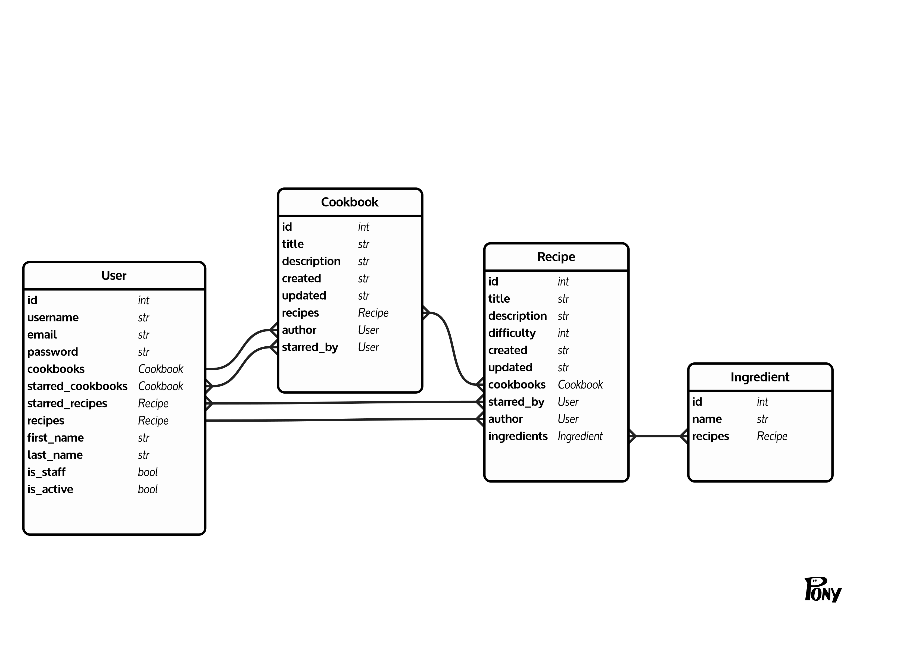

# Django cookbook API with REST framework

## Cookbook views

- Written with GenericAPIView
- Search filter applied manually

## Recipe views

- Written with generic class based views
- Search applied with django SearchFilter

## After having cloned the project, you can run it like this:

- Create a conda environment `conda env create -f requirements.yml`

- Activate the environment `conda activate django_cookbook`

- Run the Django development server `python manage.py runserver`

- Since the sqlite3 databased has been pushed, you do not need to migrate and create a new superuser. 
Visit http://localhost:8000/admin/ and login with following credentials:
    - email: admin@admin.com
    - pw: django123
 
## You can import the postman collection into Postman and test the api right away

- As per default you have to be authenticated, you will have to use the login endpoint first to get the access token

## Entity Relationship Diagram - created on https://editor.ponyorm.com/

